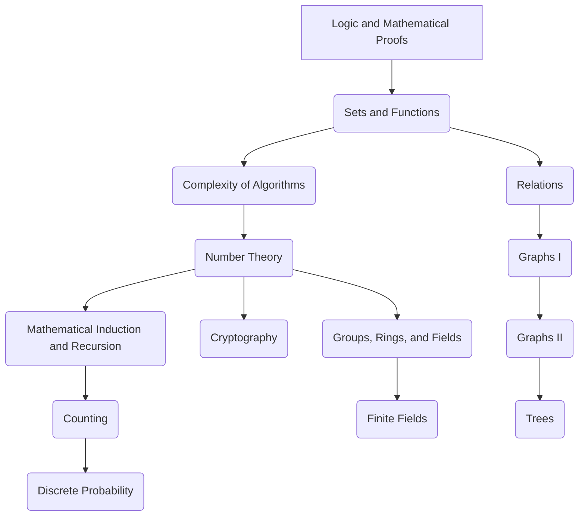

## syallbus

```mermaid
graph TD
    A[Logic and Mathematical Proofs] --> B(Sets and Functions)
    B --> C(Complexity of Algorithms)
    C --> D(Number Theory)
    D --> E(Mathematical Induction and Recursion)
    E --> F(Counting)
    F --> G(Discrete Probability)

    B --> H(Relations)
    H --> I(Graphs I)
    I --> J(Graphs II)
    J --> K(Trees)

    D --> L(Cryptography)
    D --> M(Groups, Rings, and Fields)
    M --> N(Finite Fields)
    
```
## MY Notes
[Logic](/assets/pdfs/Logic.pdf){:target="_blank"} 

[Mathematical Proofs](/assets/pdfs/Mathematical_Proof.pdf){:target="_blank"}

